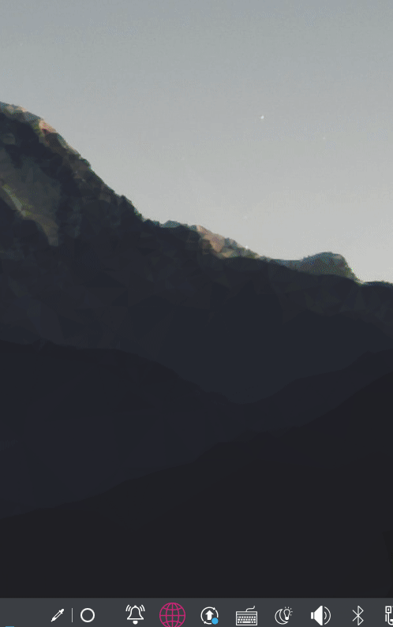

# Quietus

Quickly summon the browser from the system tray.

English | [中文](./README_ZH.md)



## Compiling

```sh
$ git clone https://github.com/TaipaXu/quietus.git
$ cd quietus
$ mkdir build && cd build
$ cmake -DCMAKE_BUILD_TYPE=Release ..
$ make -j$(nproc)
```

## License

[GPL-3.0](LICENSE)
