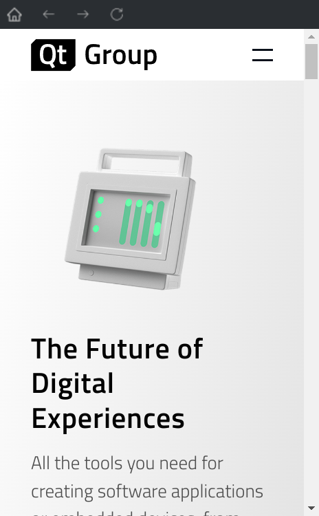

# Quietus

在系统托盘快速唤起浏览器。

[English](./README.md) | 中文



## 编译

```sh
$ git clone https://github.com/TaipaXu/quietus.git
$ cd quietus
$ mkdir build && cd build
$ cmake -DCMAKE_BUILD_TYPE=Release ..
$ make -j$(nproc)
```

## 协议

[GPL-3.0](LICENSE)
